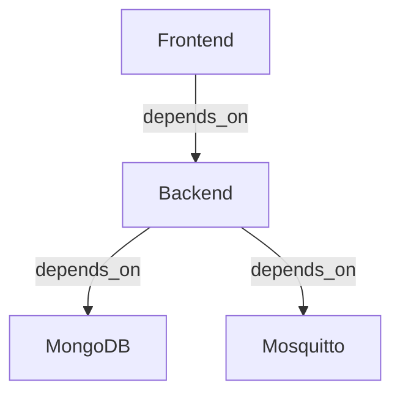

# CLAUDE.md

This file provides comprehensive guidance to Claude Code (claude.ai/code) when working with code in this repository.

---

## Table of Contents

1. [Project Overview](#project-overview)
2. [Quick Reference](#quick-reference)
3. [Commands](#commands)
4. [Architecture](#architecture)
5. [File Structure](#file-structure)
6. [Backend Deep Dive](#backend-deep-dive)
7. [MQTT Backbone System](#mqtt-backbone-system)
8. [Frontend Deep Dive](#frontend-deep-dive)
9. [GraphQL API Reference](#graphql-api-reference)
10. [State Management](#state-management)
11. [Component Architecture](#component-architecture)
12. [Data Models and Types](#data-models-and-types)
13. [Payload Configuration System](#payload-configuration-system)
14. [Testing Strategy](#testing-strategy)
15. [Development Workflow](#development-workflow)
16. [Code Style](#code-style)
17. [Environment Variables](#environment-variables)
18. [Docker Services](#docker-services)
19. [Common Patterns and Conventions](#common-patterns-and-conventions)
20. [Troubleshooting](#troubleshooting)

---

## Project Overview

**UNS Simulator** is a web-based MQTT simulation platform for testing Unified Namespace (UNS) architectures. Users create brokers, define schemas (namespace hierarchies), build simulation profiles, and run MQTT simulations that publish data to those brokers.

**Tech Stack:**
- **Backend:** Node.js + Express + Apollo Server 3 (GraphQL) + Mongoose (MongoDB) + MQTT.js
- **Frontend:** React 19 + Vite + Redux Toolkit + TailwindCSS 4 + @dnd-kit
- **Database:** MongoDB 6
- **Message Broker:** Eclipse Mosquitto 2
- **Languages:** TypeScript (strict mode)

**Key Capabilities:**
- Multi-broker MQTT connection management
- System-wide MQTT backbone for status, events, and command/control
- Hierarchical schema builder with drag-and-drop tree editing
- Advanced simulation engine with three value generation modes (static, random, increment)
- Per-node and global payload customization
- Real-time simulation status monitoring via MQTT topics
- Client-side MQTT explorer for topic inspection
- JWT-based authentication with user-scoped resources
- MQTT-based remote control and monitoring

---

## Quick Reference

### Critical Paths

| Path | Purpose |
|------|---------|
| `server/src/index.ts` | Backend entry point |
| `client/src/main.tsx` | Frontend entry point |
| `server/src/simulation/SimulationEngine.ts` | Core simulation logic |
| `server/src/graphql/` | GraphQL schemas, resolvers, models |
| `client/src/store/` | Redux slices and thunks |
| `client/src/components/` | React components |
| `client/src/pages/` | Page components |
| `client/src/api/` | GraphQL queries/mutations |

### Key Technologies

- **GraphQL Client:** `graphql-request` (not Apollo Client)
- **Drag & Drop:** `@dnd-kit/core` and `@dnd-kit/sortable`
- **UI Framework:** TailwindCSS 4 (CSS-first config)
- **MQTT Client:** `mqtt` package (v5.x)
- **Testing:** Vitest (client), Jest (server)

---

## Commands

### Linting (from repo root)
```bash
npm run lint                    # ESLint across client & server (--max-warnings=0)
npm run lint:fix                # ESLint with auto-fix
```

### Server (from server/)
```bash
npm run dev                     # Dev server with hot-reload (ts-node-dev)
npm run build                   # TypeScript compile to dist/
npm start                       # Run compiled dist/index.js
npm test                        # Run all tests once (jest)
npm run test:watch              # Watch mode (jest)
```

### Client (from client/)
```bash
npm run dev                     # Vite dev server (port 5173)
npm run build                   # TypeScript check + Vite production build
npm run preview                 # Preview production build locally
npm test                        # Run all tests once (vitest run)
npm run test:watch              # Watch mode (vitest)
```

### Docker (full stack)
```bash
docker compose up --build       # Starts MongoDB, Mosquitto, Backend (4000), Frontend (3000)
docker compose down             # Stop all services
docker compose logs -f backend  # Follow backend logs
docker compose restart backend  # Restart single service
```

### Testing
```bash
# Run all tests (client + server)
npm test                        # From root

# Client tests with coverage
cd client && npm test -- --coverage

# Server tests with specific file
cd server && npm test -- SimulationEngine.test.ts
```

---

## Architecture

### Monorepo Structure

```
uns-simulator/
├── server/                    # Backend (Node.js + GraphQL + MQTT)
│   ├── src/
│   │   ├── graphql/          # GraphQL layer
│   │   ├── simulation/       # Simulation engine
│   │   ├── mqtt/             # MQTT backbone service
│   │   ├── config/           # Configuration
│   │   ├── utils/            # Utility functions
│   │   └── __tests__/        # Jest tests
│   ├── Dockerfile
│   └── package.json
├── client/                    # Frontend (React + Redux + Vite)
│   ├── src/
│   │   ├── components/       # React components
│   │   ├── pages/            # Page components
│   │   ├── store/            # Redux slices
│   │   ├── api/              # GraphQL API layer
│   │   ├── hooks/            # Custom React hooks
│   │   ├── utils/            # Utility functions
│   │   ├── types/            # TypeScript types
│   │   ├── layout/           # Layout components
│   │   └── __tests__/        # Vitest tests
│   ├── Dockerfile
│   ├── nginx.conf
│   └── package.json
├── mqtt-broker/               # Mosquitto configuration
│   ├── mosquitto.conf
│   ├── passwd
│   └── acl
├── docker-compose.yml         # Full stack orchestration
├── CLAUDE.md                  # This file
├── README.md                  # User-facing documentation
└── package.json               # Root ESLint config
```

### System Architecture Overview

```
┌─────────────┐
│   Browser   │
└──────┬──────┘
       │ HTTP/GraphQL
       ▼
┌─────────────┐     GraphQL      ┌─────────────┐
│   Frontend  │◄────────────────►│   Backend   │
│  (React)    │                  │  (Express)  │
└─────────────┘                  └──────┬──────┘
       │                                │
       │ MQTT WebSocket                 │ MQTT TCP
       │                                │
       ▼                                ▼
┌──────────────────────────────────────────┐
│         Mosquitto MQTT Broker            │
│    (1883: TCP, 9001: WebSocket)          │
└──────────────────────────────────────────┘
                    ▲
                    │ Data Persistence
                    ▼
            ┌─────────────┐
            │   MongoDB   │
            └─────────────┘
```

---

## File Structure

### Server Directory (`server/src/`)

```
server/src/
├── index.ts                              # Express app entry point
├── metrics.ts                            # Prometheus metrics
├── graphql/
│   ├── schemas/                          # GraphQL SDL type definitions
│   │   ├── user.schema.ts
│   │   ├── broker.schema.ts
│   │   ├── schema.schema.ts
│   │   └── simulationProfile.schema.ts
│   ├── resolvers/                        # GraphQL resolvers
│   │   ├── user.resolver.ts
│   │   ├── broker.resolver.ts
│   │   ├── schema.resolver.ts
│   │   └── simulationProfile.resolver.ts
│   └── models/                           # Mongoose models
│       ├── User.ts                       # User model with bcrypt password hashing
│       ├── Broker.ts                     # Broker connection details
│       ├── Schema.ts                     # Schema with embedded nodes array
│       └── SimulationProfile.ts          # Profile with nodeSettings Map
├── simulation/
│   ├── SimulationEngine.ts               # EventEmitter-based MQTT publisher
│   └── SimulationManager.ts              # Singleton managing multiple engines
├── mqtt/
│   ├── MqttBackboneService.ts            # System-wide MQTT backbone
│   ├── commandHandler.ts                 # MQTT command message handler
│   └── topics.ts                         # Topic constants
├── config/
│   ├── constants.ts                      # App constants (MQTT config, limits)
│   └── production.ts                     # Production-specific config
├── utils/
│   └── cleanup.ts                        # Graceful shutdown utilities
├── scripts/
│   └── cleanup-broker-refs.ts            # Data migration scripts
└── __tests__/                            # Jest test files
    ├── simulation/
    │   ├── SimulationEngine.test.ts
    │   └── SimulationManager.test.ts
    ├── resolvers/
    │   ├── user.resolver.test.ts
    │   ├── broker.resolver.test.ts
    │   └── schema.resolver.test.ts
    └── helpers/
        └── mockContext.ts                # Test helper for GraphQL context
```

### Client Directory (`client/src/`)

```
client/src/
├── main.tsx                              # React entry point
├── App.tsx                               # Root component with routes
├── vite-env.d.ts                         # Vite environment types
├── layout/
│   ├── AppShell.tsx                      # Main authenticated layout
│   ├── PublicLayout.tsx                  # Public pages layout
│   ├── DashboardLayout.tsx               # Legacy dashboard layout
│   └── PrivateLayout.tsx                 # Legacy private layout
├── pages/
│   ├── app/                              # AppShell routes
│   │   ├── HomePage.tsx                  # Dashboard with stats and quick actions
│   │   └── BrokersPage.tsx               # Brokers management
│   ├── private/                          # Main feature pages
│   │   ├── SimulationPage.tsx            # Simulator with tabs
│   │   ├── SchemaBuilderPage.tsx         # Schema editor
│   │   └── MqttExplorerPage.tsx          # MQTT topic explorer
│   ├── dashboard/                        # Legacy dashboard pages
│   │   ├── DashboardPage.tsx
│   │   ├── BrokersPage.tsx
│   │   ├── SchemaPage.tsx
│   │   └── SimulatorsPage.tsx
│   ├── public/
│   │   ├── LandingPage.tsx               # Marketing landing page
│   │   ├── LoginPage.tsx
│   │   └── NotFoundPage.tsx
│   └── auth/
│       └── RegisterPage.tsx
├── components/
│   ├── ui/                               # Reusable UI primitives
│   │   ├── Card.tsx                      # Card container component
│   │   ├── Badge.tsx                     # Status/tag badges
│   │   ├── PageHeader.tsx                # Consistent page headers
│   │   ├── EmptyState.tsx                # Empty state placeholder
│   │   ├── SlideOver.tsx                 # Side panel overlay
│   │   ├── Avatar.tsx                    # User avatar component
│   │   └── Tooltip.tsx                   # Tooltip wrapper
│   ├── schema/                           # Schema builder components
│   │   ├── SchemaManager.tsx             # Toolbar with CRUD controls
│   │   ├── SchemaNodeEditor.tsx          # Two-panel editor layout
│   │   ├── TreeNode.tsx                  # Recursive tree node component
│   │   ├── FileUpload.tsx                # Schema JSON import
│   │   ├── MovePickerModal.tsx           # Node move dialog
│   │   ├── SchemaCard.tsx                # Schema display card
│   │   └── SchemaTable.tsx               # Schema table view
│   ├── simulator/                        # Simulation UI components
│   │   ├── SimulatorCardContent.tsx      # Main tabbed interface
│   │   ├── SimulatorCard.tsx             # Simulator card wrapper
│   │   ├── SimulationControls.tsx        # Start/stop/pause buttons
│   │   ├── SimulationConsole.tsx         # Live log viewer
│   │   ├── SimulatorNodeSettings.tsx     # Per-node config form
│   │   ├── SimulatorGlobalForm.tsx       # Global settings form
│   │   └── NodePayloadEditor.tsx         # Payload config editor
│   ├── Brokers/                          # Broker management components
│   │   ├── BrokerCard.tsx                # Broker display card
│   │   ├── BrokerList.tsx                # Broker grid/list view
│   │   ├── BrokerForm.tsx                # Add/edit broker form
│   │   ├── BrokerModal.tsx               # Broker modal dialog
│   │   ├── MqttViewer.tsx                # MQTT topic viewer
│   │   ├── MqttTopicTree.tsx             # Collapsible topic tree
│   │   └── MqttMessageViewer.tsx         # Message detail viewer
│   ├── dashboard/
│   │   └── StatCard.tsx                  # Dashboard stat cards
│   ├── global/                           # Global components
│   └── ErrorBoundary.tsx                 # React error boundary
├── store/
│   ├── store.ts                          # Redux store configuration
│   ├── constants.ts                      # Redux constants
│   ├── auth/
│   │   ├── authSlice.ts                  # Auth state + reducers
│   │   ├── authThunks.ts                 # Login/register async thunks
│   │   └── authTypes.ts                  # Auth type definitions
│   ├── brokers/
│   │   ├── brokerSlice.ts                # Broker CRUD reducers
│   │   ├── brokerThunks.ts               # Broker async operations
│   │   └── brokerTypes.ts                # Broker type definitions
│   ├── schema/
│   │   ├── schemaSlice.ts                # Schema state management
│   │   ├── schemaThunk.ts                # Schema async operations
│   │   └── schemaTypes.ts                # Schema type definitions
│   ├── simulationProfile/
│   │   ├── simulationProfileSlice.ts     # Profile state + reducers
│   │   └── simulationProfieThunk.ts      # Profile async operations (note typo in filename)
│   └── mqtt/
│       ├── mqttSlice.ts                  # Client MQTT connections
│       ├── mqttThunk.ts                  # MQTT async operations
│       ├── systemMqttSlice.ts            # System MQTT state
│       ├── systemMqttThunk.ts            # System MQTT operations
│       └── mqttClientManager.ts          # MQTT client lifecycle
├── api/
│   ├── auth.ts                           # Auth API calls
│   ├── brokers.ts                        # Broker API calls
│   ├── schema.ts                         # Schema API calls
│   ├── simulationProfile.ts              # Simulation API calls
│   ├── queries/
│   │   ├── broker.queries.ts             # GraphQL broker queries
│   │   ├── schema.queries.ts             # GraphQL schema queries
│   │   └── simulationProfile.queries.ts  # GraphQL profile queries
│   └── mutations/
│       ├── auth.mutations.ts             # GraphQL auth mutations
│       ├── brokerMutations.ts            # GraphQL broker mutations
│       ├── schema.mutations.ts           # GraphQL schema mutations
│       └── simulationProfile.mutation.ts # GraphQL profile mutations
├── utils/
│   ├── tree.ts                           # Tree manipulation helpers
│   ├── mqttConnection.ts                 # MQTT connection helper
│   ├── mqttConnectionManager.ts          # Multi-connection manager
│   ├── mqttTopicTree.ts                  # Topic tree builder
│   ├── parseSchemaFile.ts                # JSON schema parser
│   ├── errorUtils.ts                     # Error handling utilities
│   └── uuid.ts                           # UUID generation
├── hooks/
│   ├── useDarkMode.ts                    # Dark mode toggle hook
│   └── useMqttConnections.ts             # MQTT connection hook
├── types/
│   ├── index.ts                          # Type exports
│   ├── auth.ts                           # Auth types
│   ├── broker.ts                         # Broker types
│   ├── schema.ts                         # Schema types
│   ├── simulationProfile.ts              # Profile types
│   ├── mqtt.ts                           # MQTT types
│   ├── store.ts                          # Redux store types
│   └── env.d.ts                          # Environment variable types
├── test/
│   └── setup.ts                          # Vitest global setup
└── __tests__/
    ├── store/
    │   ├── authSlice.test.ts
    │   ├── brokerSlice.test.ts
    │   └── schemaSlice.test.ts
    └── utils/
        ├── tree.test.ts
        ├── parseSchemaFile.test.ts
        ├── buildTopicTree.test.ts
        └── errorUtils.test.ts
```

---

## Backend Deep Dive

### Entry Point (`server/src/index.ts`)

The Express application with:
- **Helmet:** Security headers
- **CORS:** Configured with `CLIENT_URL` origin
- **Compression:** Response compression middleware
- **Rate Limiting:** Optional (controlled by `ENABLE_RATE_LIMIT` env var)
- **Apollo Server 3:** GraphQL endpoint at `/graphql`
- **MongoDB Connection:** Via Mongoose with retry logic
- **Graceful Shutdown:** SIGTERM/SIGINT handlers that stop all running simulations

**Key responsibilities:**
1. Initialize MongoDB connection
2. Set up Express middleware stack
3. Configure Apollo Server with merged schemas and resolvers
4. Start HTTP server on port 4000
5. Register shutdown handlers to cleanup simulations

### GraphQL Layer

**Type Definitions:** GraphQL SDL files in `graphql/schemas/`
- `user.schema.ts`: User type, login/register mutations
- `broker.schema.ts`: Broker CRUD operations
- `schema.schema.ts`: Schema CRUD with nested nodes
- `simulationProfile.schema.ts`: Comprehensive profile types with unions for NodeBehavior, simulation status, logs, and control mutations

**Resolvers:** Pure functions in `graphql/resolvers/`
- All resolvers receive `context.user` from JWT verification
- User-scoped queries: `{ userId: context.user.id }`
- Error handling: Throws `ApolloError` for authentication/validation errors
- Simulation control resolvers delegate to `SimulationManager`

**Models:** Mongoose schemas in `graphql/models/`
- `User`: Email (unique), password (bcrypt hashed), createdAt/updatedAt
- `Broker`: Connection details (host, port, WS port), optional credentials, user reference
- `Schema`: Name, description, nodes array (embedded documents), user reference
- `SimulationProfile`: Complex model with global settings, nodeSettings Map, status tracking, user reference

**Authentication Flow:**
1. User logs in → `login` mutation
2. JWT token generated with `{ id, email }` payload
3. Client includes `Authorization: Bearer <token>` header
4. `getContext()` verifies token and injects `user` into GraphQL context
5. Protected resolvers check `context.user`

### Simulation Engine (`server/src/simulation/`)

#### SimulationEngine.ts

**Core class:** `SimulationEngine extends EventEmitter`

**Constructor:**
```typescript
constructor(profile: ISimulationProfile, schema: ISchema, broker: IBroker)
```

**Key methods:**
- `start()`: Connect to MQTT broker, start publishing intervals for all nodes
- `stop()`: Disconnect MQTT, clear all intervals, reset state
- `pause()`: Stop publishing intervals but keep MQTT connection
- `resume()`: Restart publishing intervals from paused state
- `getStatus()`: Return current simulation state and metadata
- `getLogs(since?: number)`: Retrieve buffered log entries
- `testPublishNode(nodeId: string)`: Publish single test message

**Publishing Flow:**
1. Initialize nodes from schema (filter `kind === 'metric'`)
2. For each node, merge payload config: `nodeSettings.payload` > `globalSettings.defaultPayload` > defaults
3. Start interval for each node based on frequency (converted to milliseconds)
4. Generate payload using configured value mode (static/random/increment)
5. Publish to MQTT topic: `${publishRoot}/${node.path}`
6. Handle failures based on `failRate` probability

**Value Generation Modes:**
- **Static:** Returns fixed `value` from config
- **Random:** Generates random value between `minValue` and `maxValue` with optional `precision`
- **Increment:** Steps value by `step`, wraps at `maxValue`

**State Management:**
- `isRunning`: Engine is actively publishing
- `isPaused`: Engine is paused (MQTT connected but not publishing)
- `startTime`: Timestamp when simulation started
- `lastActivity`: Last successful publish time
- `mqttConnected`: MQTT client connection status
- `reconnectAttempts`: Count of reconnection attempts

**Event Emitters:**
- `log`: Emitted for each log entry (info/warn/error)
- `status`: Emitted on state changes

**Reconnection Logic:**
- Exponential backoff with configurable max attempts
- On disconnect: Auto-reconnect unless manually stopped
- On max attempts exceeded: Transition to error state

#### SimulationManager.ts

**Singleton class:** Manages multiple concurrent simulations

**Key methods:**
- `startSimulation(profileId: string)`: Load profile, schema, broker, create engine, start
- `stopSimulation(profileId: string)`: Stop and destroy engine instance
- `pauseSimulation(profileId: string)`: Pause engine
- `resumeSimulation(profileId: string)`: Resume paused engine
- `getStatus(profileId: string)`: Get current status of simulation
- `getLogs(profileId: string, since?: number)`: Retrieve logs for profile
- `stopAll()`: Stop all running simulations (used on server shutdown)
- `testPublishNode(profileId: string, nodeId: string)`: Test publish without full simulation

**Storage:** `Map<string, SimulationEngine>` keyed by profile ID

**Initialization:** On server startup, reset any orphaned profiles (left running from crash) to "stopped" state

---

## MQTT Backbone System

The MQTT Backbone is a system-wide MQTT connection that provides centralized monitoring, status publishing, and command/control capabilities. It connects to the local MQTT broker as the `uns-backend` system user and publishes application state to well-known topics under `uns-simulator/_sys/`.

### Architecture Overview

```
┌─────────────────────────────────────────────────────────────┐
│                    UNS Simulator Backend                     │
│                                                               │
│  ┌─────────────────┐          ┌─────────────────────────┐  │
│  │   GraphQL API   │          │  MQTT Backbone Service  │  │
│  │   (Commands)    │          │  (uns-backend user)     │  │
│  └────────┬────────┘          └──────────┬──────────────┘  │
│           │                              │                  │
│           │  ┌──────────────────────┐   │                  │
│           └─►│ SimulationManager    │◄──┘                  │
│              │  ┌─────────────┐     │                      │
│              │  │  Engine 1   │     │                      │
│              │  ├─────────────┤     │                      │
│              │  │  Engine 2   │     │                      │
│              │  └─────────────┘     │                      │
│              └──────────────────────┘                      │
└───────────────────────┬────────────────────────────────────┘
                        │
                        ▼
                ┌───────────────┐
                │ MQTT Broker   │
                │ (Mosquitto)   │
                └───────┬───────┘
                        │
         ┌──────────────┼──────────────┐
         ▼              ▼              ▼
    System Topics  Simulation     Client Apps
    (_sys/*)       Data Topics    (uns-client)
```

### Topic Hierarchy

All system topics live under the `uns-simulator/_sys/` prefix to separate them from user-defined simulation data:

```
uns-simulator/_sys/
├── status/                      # Retained status messages
│   ├── server                   # Server health & uptime
│   ├── simulations/
│   │   ├── _index              # List of active simulations
│   │   └── {profileId}         # Per-simulation status
│   └── brokers/
│       ├── _index              # Broker registry (future)
│       └── {brokerId}          # Per-broker status (future)
│
├── logs/                        # Non-retained log streams
│   └── simulations/
│       └── {profileId}         # Per-simulation logs
│
├── events/                      # Non-retained events
│   ├── system                  # Server lifecycle events
│   └── simulation              # Simulation lifecycle events
│
├── cmd/                         # Command topics (write-only for uns-client)
│   └── simulation/
│       ├── start
│       ├── stop
│       ├── pause
│       └── resume
│
└── cmd-response/                # Command responses
    └── {correlationId}         # Response to specific command
```

### MqttBackboneService.ts

**Singleton class** that manages the system MQTT connection.

**Constructor:**
```typescript
constructor()
```
- Initializes command handler
- Sets up event emitters

**Key methods:**

**Connection Management:**
- `connect()`: Connect to MQTT broker with credentials from environment
- `disconnect()`: Gracefully disconnect and stop heartbeat
- `isConnected()`: Check connection status

**Status Publishing (Retained):**
- `publishServerStatus()`: Publish server health, uptime, database state
- `publishSimulationStatus(profileId, status)`: Publish simulation state
- `publishSimulationIndex(profileIds)`: Publish list of active simulations
- `clearSimulationStatus(profileId)`: Clear retained status for stopped simulation

**Log Publishing (Non-Retained):**
- `publishSimulationLog(profileId, log)`: Stream simulation log entries

**Event Publishing (Non-Retained):**
- `publishSimulationEvent(event, data)`: Publish simulation lifecycle events
- `publishSystemEvent(event, data)`: Publish system events (startup, shutdown)

**Command Publishing:**
- `publishCommand(topic, profileId, userId)`: Publish UI-originated commands
- `publishCommandResponse(correlationId, response)`: Respond to commands

**Configuration:**
```typescript
MQTT_BACKBONE_CONFIG = {
  CLIENT_ID: 'uns-backend-system',
  HEARTBEAT_INTERVAL: 30000,        // 30 seconds
  CONNECT_TIMEOUT: 10000,           // 10 seconds
  RECONNECT_PERIOD: 5000,           // Auto-reconnect every 5s
  KEEPALIVE: 30,
  QOS_STATUS: 1,                    // At-least-once for status
  QOS_EVENTS: 0,                    // At-most-once for events
}
```

**Lifecycle:**
1. Server startup → `mqttBackbone.connect()`
2. On connect → Subscribe to `uns-simulator/_sys/cmd/#`
3. Start heartbeat → Publish server status every 30s
4. On shutdown → `publishSystemEvent('shutdown')`, disconnect

### Command Handler (commandHandler.ts)

Handles incoming MQTT commands on `_sys/cmd/#` topics.

**Security:**
- Commands are ACL-protected at broker level
- Only `uns-client` user can write to `cmd/` topics
- UI-originated commands (origin='ui') are skipped (already executed by GraphQL)
- External commands (e.g., from MQTT clients) are validated and executed

**Command Flow:**
```
1. MQTT client publishes to uns-simulator/_sys/cmd/simulation/start
   {
     "profileId": "abc123",
     "correlationId": "ext-12345",
     "origin": "external"
   }

2. Command handler receives message
   - Validates payload (JSON parse)
   - Checks origin (skip if 'ui')
   - Validates required fields (profileId)

3. Execute command
   - Load profile, schema, broker from database
   - Call SimulationManager.startSimulation()

4. Publish response
   uns-simulator/_sys/cmd-response/ext-12345
   {
     "correlationId": "ext-12345",
     "success": true,
     "error": null,
     "timestamp": 1738857600000
   }
```

**Supported Commands:**
- `CMD_SIMULATION_START`: Start simulation
- `CMD_SIMULATION_STOP`: Stop simulation
- `CMD_SIMULATION_PAUSE`: Pause simulation
- `CMD_SIMULATION_RESUME`: Resume simulation

**Error Handling:**
- Invalid JSON → Log error, no response
- Missing profileId → Publish error response
- Command execution failure → Publish error response with message

### Topic Constants (topics.ts)

Centralized topic definitions:

```typescript
const PREFIX = 'uns-simulator/_sys';

export const TOPICS = {
  // Status (retained)
  STATUS_SERVER: `${PREFIX}/status/server`,
  STATUS_SIMULATION: (id: string) => `${PREFIX}/status/simulations/${id}`,
  STATUS_SIMULATIONS_INDEX: `${PREFIX}/status/simulations/_index`,

  // Logs (non-retained)
  LOGS_SIMULATION: (id: string) => `${PREFIX}/logs/simulations/${id}`,

  // Events (non-retained)
  EVENTS_SYSTEM: `${PREFIX}/events/system`,
  EVENTS_SIMULATION: `${PREFIX}/events/simulation`,

  // Commands
  CMD_SIMULATION_START: `${PREFIX}/cmd/simulation/start`,
  CMD_SIMULATION_STOP: `${PREFIX}/cmd/simulation/stop`,
  CMD_SIMULATION_PAUSE: `${PREFIX}/cmd/simulation/pause`,
  CMD_SIMULATION_RESUME: `${PREFIX}/cmd/simulation/resume`,
  CMD_WILDCARD: `${PREFIX}/cmd/#`,

  // Command Responses
  CMD_RESPONSE: (correlationId: string) =>
    `${PREFIX}/cmd-response/${correlationId}`,
} as const;
```

### Integration with SimulationManager

The SimulationManager forwards all engine lifecycle events to the MQTT backbone:

```typescript
// Forward engine lifecycle events to MQTT backbone
engine.on('started', () => {
  mqttBackbone.publishSimulationStatus(profileId, engine.getStatus());
  mqttBackbone.publishSimulationEvent('started', { profileId, name });
});

engine.on('stopped', () => {
  mqttBackbone.clearSimulationStatus(profileId);
  mqttBackbone.publishSimulationEvent('stopped', { profileId, name });
});

engine.on('paused', () => {
  mqttBackbone.publishSimulationStatus(profileId, engine.getStatus());
  mqttBackbone.publishSimulationEvent('paused', { profileId, name });
});

engine.on('resumed', () => {
  mqttBackbone.publishSimulationStatus(profileId, engine.getStatus());
  mqttBackbone.publishSimulationEvent('resumed', { profileId, name });
});

engine.on('statusUpdate', () => {
  mqttBackbone.publishSimulationStatus(profileId, engine.getStatus());
});

// Forward all log entries to MQTT backbone
engine.on('log', (entry: SimulationLogEntry) => {
  mqttBackbone.publishSimulationLog(profileId, { ...entry });
});
```

### Server Status Payload

Published to `uns-simulator/_sys/status/server` every 30 seconds:

```json
{
  "status": "ok",
  "uptime": 3600,
  "database": "connected",
  "timestamp": 1738857600000
}
```

### Simulation Status Payload

Published to `uns-simulator/_sys/status/simulations/{profileId}`:

```json
{
  "profileId": "abc123",
  "state": "running",
  "isRunning": true,
  "isPaused": false,
  "mqttConnected": true,
  "startTime": 1738857000000,
  "lastActivity": 1738857600000,
  "nodeCount": 10,
  "publishCount": 1234,
  "timestamp": 1738857600000
}
```

### Simulation Log Payload

Published to `uns-simulator/_sys/logs/simulations/{profileId}`:

```json
{
  "timestamp": 1738857600000,
  "level": "info",
  "message": "Published to enterprise/site1/area2/temperature",
  "topic": "enterprise/site1/area2/temperature",
  "nodeId": "temp_sensor_1"
}
```

### Event Payloads

**System Events** (`_sys/events/system`):
```json
{
  "event": "started",
  "environment": "production",
  "timestamp": 1738857600000
}
```

**Simulation Events** (`_sys/events/simulation`):
```json
{
  "event": "started",
  "profileId": "abc123",
  "name": "Factory Floor Simulation",
  "timestamp": 1738857600000
}
```

### Authentication & Authorization

**MQTT Users:**
- `uns-backend` - System backend (write to all _sys/ topics)
- `uns-sim` - Simulation engines (write to data topics)
- `uns-client` - Client applications (read _sys/, write to _sys/cmd/)

**ACL Configuration:**
Defined in `mqtt-broker/acl`:
```
# uns-backend (system) - full access
user uns-backend
topic readwrite uns-simulator/_sys/#

# uns-sim (simulations) - write to data topics only
user uns-sim
topic write #
topic read uns-simulator/_sys/status/#

# uns-client (UI/external) - read status, write commands
user uns-client
topic read uns-simulator/_sys/#
topic write uns-simulator/_sys/cmd/#
```

### Monitoring with MQTT Explorer

To monitor system status in real-time:

1. Connect MQTT Explorer to broker (localhost:1883)
2. Subscribe to `uns-simulator/_sys/#`
3. View retained status messages immediately
4. Watch live log streams and events
5. Publish commands to control simulations

**Example command:**
```json
Topic: uns-simulator/_sys/cmd/simulation/start
Payload:
{
  "profileId": "abc123",
  "correlationId": "external-cmd-001",
  "origin": "external"
}
```

---

## Frontend Deep Dive

### Entry Point (`client/src/main.tsx`)

React 19 application:
```typescript
ReactDOM.createRoot(document.getElementById('root')!).render(
  <React.StrictMode>
    <Provider store={store}>
      <App />
    </Provider>
  </React.StrictMode>
)
```

### Routing (`client/src/App.tsx`)

**Three-tier layout structure:**

1. **PublicLayout** (`/`):
   - Landing page
   - Login (`/login`)
   - Register (`/register`)

2. **AppShell** (`/app/*`):
   - Unified authenticated layout with collapsible sidebar
   - HomePage (`/app/home`) - Dashboard with stats, quick actions, recent profiles
   - BrokersPage (`/app/brokers`) - Broker management
   - SchemaBuilderPage (`/app/schema-builder`) - Schema editor
   - SimulationPage (`/app/simulator`) - Simulation control
   - MqttExplorerPage (`/app/mqtt-explorer`) - MQTT topic explorer

3. **Legacy routes:**
   - DashboardLayout (`/dashboard/*`) - redirects to `/app/*`
   - PrivateLayout (various routes) - redirects to `/app/*`

**Protected routes:** Check for JWT token in sessionStorage, redirect to `/login` if missing

### Layout Components

#### AppShell.tsx

**Main authenticated layout:**
- Left sidebar with navigation links
- Collapsible sidebar toggle
- Top bar with user profile and logout
- Main content area with page transitions
- Breadcrumb navigation
- Dark mode toggle

**Navigation structure:**
```typescript
[
  { name: 'Home', path: '/app/home', icon: HomeIcon },
  { name: 'Simulators', path: '/app/simulator', icon: PlayIcon },
  { name: 'Schema Builder', path: '/app/schema-builder', icon: CubeIcon },
  { name: 'MQTT Explorer', path: '/app/mqtt-explorer', icon: ChartBarIcon },
  { name: 'Brokers', path: '/app/brokers', icon: ServerIcon },
]
```

### Component Organization

#### UI Primitives (`components/ui/`)

**Card.tsx:** Flexible card container
```typescript
<Card>
  <Card.Header>Title</Card.Header>
  <Card.Body>Content</Card.Body>
  <Card.Footer>Actions</Card.Footer>
</Card>
```

**Badge.tsx:** Status badges with color variants
```typescript
<Badge variant="success">Running</Badge>
<Badge variant="error">Error</Badge>
```

**PageHeader.tsx:** Consistent page headers
```typescript
<PageHeader
  title="Simulators"
  description="Manage simulation profiles"
  action={<Button>Create</Button>}
/>
```

**EmptyState.tsx:** Empty state placeholders
```typescript
<EmptyState
  icon={InboxIcon}
  title="No brokers found"
  description="Get started by creating your first broker"
  action={<Button>Add Broker</Button>}
/>
```

**SlideOver.tsx:** Side panel overlay (uses Headless UI)
```typescript
<SlideOver open={isOpen} onClose={() => setIsOpen(false)}>
  <SlideOver.Title>Edit Broker</SlideOver.Title>
  <SlideOver.Content>Form content</SlideOver.Content>
</SlideOver>
```

#### Schema Builder (`components/schema/`)

**SchemaManager.tsx:**
- Dropdown schema selector
- Inline schema creation (name input + create button)
- Delete schema with confirmation dialog
- Compact toolbar design

**SchemaNodeEditor.tsx:**
- Two-panel layout (60/40 split)
- Left panel: Tree view with saved + temporary nodes merged
- Right panel: Node builder form with path preview
- Drag-and-drop reordering via @dnd-kit
- Breadcrumb navigation showing parent path

**TreeNode.tsx:**
- Recursive component rendering tree hierarchy
- Icons: Folder (group), Metric (metric), Cube (object)
- Expand/collapse for groups
- Inline rename on double-click
- Drag handle for reordering
- Data type badge display
- Hover-visible delete button

**Key drag-and-drop features:**
- Uses `@dnd-kit/core` and `@dnd-kit/sortable`
- Supports reordering within parent
- Supports moving to different parent (via modal)
- Auto-recalculates paths after move
- Optimistic UI updates with server sync

#### Simulator (`components/simulator/`)

**SimulatorCardContent.tsx:**
- Three tabs: Overview, Node Settings, Global Settings
- Overview: Simulation status, controls, live console
- Node Settings: Per-node configuration table
- Global Settings: Profile-wide settings form

**SimulationControls.tsx:**
- Start/Stop/Pause/Resume buttons
- State-aware button visibility
- Loading states during transitions

**SimulationConsole.tsx:**
- Live log viewer with auto-scroll
- Color-coded log levels (info, warn, error)
- Timestamp formatting
- Scrollable container with max height

**SimulatorNodeSettings.tsx:**
- Table of all metric nodes from selected schema
- Collapsible payload editor for each node
- Per-node frequency and fail rate inputs
- Default values inherited from global settings

**SimulatorGlobalForm.tsx:**
- Publish root input (MQTT topic prefix)
- Default frequency (updates/minute)
- Default fail rate (0-1 probability)
- Default payload template (inherited by all nodes)

**NodePayloadEditor.tsx:**
- Quality selector (good, bad, uncertain, custom)
- Timestamp mode: Auto (Date.now()) or Fixed
- Value generation mode selector: Static, Random, Increment
- Mode-specific inputs (minValue/maxValue/step/precision)
- Custom fields editor (key-value pairs with type)
- Live JSON preview of generated payload
- Inline validation

---

## GraphQL API Reference

### Authentication

**login**
```graphql
mutation Login($email: String!, $password: String!) {
  login(email: $email, password: $password) {
    token
    user {
      id
      email
    }
  }
}
```

**register**
```graphql
mutation Register($email: String!, $password: String!) {
  register(email: $email, password: $password) {
    token
    user {
      id
      email
    }
  }
}
```

### Brokers

**Query brokers**
```graphql
query Brokers {
  brokers {
    id
    name
    host
    port
    wsPort
    username
    clientId
    createdAt
  }
}
```

**Create broker**
```graphql
mutation CreateBroker($input: BrokerInput!) {
  createBroker(input: $input) {
    id
    name
    host
  }
}
```

**Update broker**
```graphql
mutation UpdateBroker($id: ID!, $input: BrokerInput!) {
  updateBroker(id: $id, input: $input) {
    id
    name
  }
}
```

**Delete broker**
```graphql
mutation DeleteBroker($id: ID!) {
  deleteBroker(id: $id)
}
```

### Schemas

**Query schemas**
```graphql
query Schemas {
  schemas {
    id
    name
    description
    nodes {
      id
      name
      kind
      path
      dataType
      parentId
    }
    createdAt
  }
}
```

**Create schema**
```graphql
mutation CreateSchema($input: SchemaInput!) {
  createSchema(input: $input) {
    id
    name
    nodes {
      id
      name
      path
    }
  }
}
```

**Update schema**
```graphql
mutation UpdateSchema($id: ID!, $input: SchemaInput!) {
  updateSchema(id: $id, input: $input) {
    id
    name
  }
}
```

**Delete schema**
```graphql
mutation DeleteSchema($id: ID!) {
  deleteSchema(id: $id)
}
```

### Simulation Profiles

**Query profiles**
```graphql
query SimulationProfiles {
  simulationProfiles {
    id
    name
    schemaId
    brokerId
    globalSettings {
      defaultUpdateFrequency
      publishRoot
      defaultPayload
    }
    nodeSettings {
      nodeId
      frequency
      failRate
      payload {
        quality
        timestampMode
        valueMode
        minValue
        maxValue
      }
    }
    status {
      state
      isRunning
      isPaused
      mqttConnected
    }
  }
}
```

**Create profile**
```graphql
mutation CreateProfile($input: SimulationProfileInput!) {
  createSimulationProfile(input: $input) {
    id
    name
  }
}
```

**Start simulation**
```graphql
mutation StartSimulation($profileId: ID!) {
  startSimulation(profileId: $profileId)
}
```

**Stop simulation**
```graphql
mutation StopSimulation($profileId: ID!) {
  stopSimulation(profileId: $profileId)
}
```

**Pause simulation**
```graphql
mutation PauseSimulation($profileId: ID!) {
  pauseSimulation(profileId: $profileId)
}
```

**Resume simulation**
```graphql
mutation ResumeSimulation($profileId: ID!) {
  resumeSimulation(profileId: $profileId)
}
```

**Test publish node**
```graphql
mutation TestPublishNode($profileId: ID!, $nodeId: ID!) {
  testPublishNode(profileId: $profileId, nodeId: $nodeId) {
    success
    topic
    payload
    error
  }
}
```

**Upsert node settings**
```graphql
mutation UpsertNodeSettings(
  $profileId: ID!
  $nodeId: ID!
  $settings: NodeSettingsInput!
) {
  upsertNodeSettings(
    profileId: $profileId
    nodeId: $nodeId
    settings: $settings
  ) {
    nodeId
    frequency
    failRate
  }
}
```

**Get simulation logs**
```graphql
query SimulationLogs($profileId: ID!, $since: Float) {
  simulationLogs(profileId: $profileId, since: $since) {
    timestamp
    level
    message
    topic
    nodeId
  }
}
```

---

## State Management

### Redux Store Configuration (`store/store.ts`)

```typescript
{
  auth: {
    user: User | null,
    token: string | null,
    loading: boolean,
    error: string | null
  },
  brokers: {
    brokers: Broker[],
    selectedBroker: Broker | null,
    loading: boolean,
    error: string | null
  },
  schema: {
    schemas: Schema[],
    selectedSchema: Schema | null,
    tempNodes: TempNode[],
    loading: boolean,
    error: string | null
  },
  simulationProfile: {
    profiles: SimulationProfile[],
    selectedProfile: SimulationProfile | null,
    loading: boolean,
    error: string | null
  },
  mqtt: {
    connections: Map<string, MqttClient>,  // non-serializable
    messages: MqttMessage[],
    subscriptions: string[],
    connectionStatus: 'disconnected' | 'connecting' | 'connected' | 'error'
  },
  systemMqtt: {
    connected: boolean,
    messages: SystemMessage[]
  }
}
```

### Redux Middleware Configuration

```typescript
middleware: (getDefaultMiddleware) =>
  getDefaultMiddleware({
    serializableCheck: {
      ignoredActions: ['mqtt/setConnectionStatus'],
      ignoredPaths: ['mqtt.connections'],
    },
  })
```

**Why:** MQTT client instances are non-serializable, excluded from Redux serialization checks

### Key Thunks

**Auth:**
- `login(email, password)`: Authenticate user, store JWT in sessionStorage
- `register(email, password)`: Create account, store JWT

**Brokers:**
- `fetchBrokers()`: Load all user brokers
- `createBroker(input)`: Create new broker
- `updateBroker(id, input)`: Update broker
- `deleteBroker(id)`: Delete broker

**Schema:**
- `fetchSchemas()`: Load all user schemas
- `createSchema(input)`: Create new schema
- `updateSchema(id, input)`: Update schema with nodes
- `deleteSchema(id)`: Delete schema
- `addTempNode(node)`: Add temporary node before save
- `deleteTempNode(id)`: Remove temporary node
- `saveTempNodes()`: Persist temporary nodes to server

**Simulation Profiles:**
- `fetchProfiles()`: Load all user profiles
- `createProfile(input)`: Create new profile
- `updateProfile(id, input)`: Update profile
- `deleteProfile(id)`: Delete profile
- `startSimulation(profileId)`: Start simulation
- `stopSimulation(profileId)`: Stop simulation
- `pauseSimulation(profileId)`: Pause simulation
- `resumeSimulation(profileId)`: Resume simulation
- `fetchSimulationStatus(profileId)`: Poll status
- `fetchSimulationLogs(profileId, since)`: Fetch logs

**MQTT:**
- `connectMqtt(brokerId)`: Create WebSocket MQTT connection
- `disconnectMqtt(brokerId)`: Close connection
- `subscribeTopic(brokerId, topic)`: Subscribe to topic
- `unsubscribeTopic(brokerId, topic)`: Unsubscribe from topic

---

## Component Architecture

### Page Component Pattern

All feature pages follow this structure:

```typescript
// 1. Imports (React, Redux, components, types)
import { useEffect } from 'react';
import { useDispatch, useSelector } from 'react-redux';
import { PageHeader, Card, EmptyState } from '../components/ui';

// 2. Component definition
export default function FeaturePage() {
  const dispatch = useDispatch();
  const { items, loading, error } = useSelector(state => state.feature);

  // 3. Data fetching on mount
  useEffect(() => {
    dispatch(fetchItems());
  }, [dispatch]);

  // 4. Loading state
  if (loading) return <LoadingSpinner />;

  // 5. Error state
  if (error) return <ErrorMessage error={error} />;

  // 6. Empty state
  if (!items.length) return <EmptyState />;

  // 7. Content render
  return (
    <>
      <PageHeader title="Feature" />
      <div className="grid grid-cols-3 gap-4">
        {items.map(item => <ItemCard key={item.id} item={item} />)}
      </div>
    </>
  );
}
```

### Form Component Pattern

```typescript
// 1. Local state for form fields
const [formData, setFormData] = useState({
  name: '',
  description: '',
});

// 2. Handle input changes
const handleChange = (e) => {
  setFormData(prev => ({
    ...prev,
    [e.target.name]: e.target.value
  }));
};

// 3. Handle submit
const handleSubmit = async (e) => {
  e.preventDefault();
  try {
    await dispatch(createItem(formData)).unwrap();
    toast.success('Item created');
    onClose();
  } catch (error) {
    toast.error('Failed to create item');
  }
};

// 4. Render form
return (
  <form onSubmit={handleSubmit}>
    <input name="name" value={formData.name} onChange={handleChange} />
    <button type="submit">Create</button>
  </form>
);
```

### Tree Component Pattern (Schema Builder)

**Recursive rendering:**
```typescript
function TreeNode({ node, level = 0 }) {
  const [isExpanded, setIsExpanded] = useState(false);
  const children = useSelector(state =>
    selectChildrenByParentId(state, node.id)
  );

  return (
    <div style={{ paddingLeft: `${level * 20}px` }}>
      {node.kind === 'group' && (
        <button onClick={() => setIsExpanded(!isExpanded)}>
          {isExpanded ? '▼' : '▶'}
        </button>
      )}
      <span>{node.name}</span>
      {isExpanded && children.map(child => (
        <TreeNode key={child.id} node={child} level={level + 1} />
      ))}
    </div>
  );
}
```

---

## Data Models and Types

### Server Models (Mongoose)

**User** (`server/src/graphql/models/User.ts`):
```typescript
{
  email: string (unique, required)
  password: string (bcrypt hashed, required)
  createdAt: Date
  updatedAt: Date
}
```

**Broker** (`server/src/graphql/models/Broker.ts`):
```typescript
{
  name: string (required)
  host: string (required)
  port: number (default: 1883)
  wsPort: number (default: 9001)
  username?: string
  password?: string
  clientId?: string
  userId: ObjectId (ref: User, required)
  createdAt: Date
  updatedAt: Date
}
```

**Schema** (`server/src/graphql/models/Schema.ts`):
```typescript
{
  name: string (required)
  description?: string
  nodes: SchemaNode[] (embedded documents)
  userId: ObjectId (ref: User, required)
  createdAt: Date
  updatedAt: Date
}

SchemaNode {
  id: string (UUID)
  name: string
  kind: 'group' | 'metric' | 'object'
  path: string (e.g., 'enterprise/site/area')
  dataType?: 'Int' | 'Float' | 'Bool' | 'String' | 'JSON'
  parentId?: string
  createdAt: Date
}
```

**SimulationProfile** (`server/src/graphql/models/SimulationProfile.ts`):
```typescript
{
  name: string (required)
  description?: string
  schemaId: ObjectId (ref: Schema, required)
  brokerId?: ObjectId (ref: Broker)
  globalSettings: {
    defaultUpdateFrequency: number (default: 60)
    timeScale: number (default: 1.0)
    publishRoot?: string
    startDelay?: number
    simulationLength?: number
    defaultPayload?: object
  }
  nodeSettings: Map<string, NodeSettings>
  userId: ObjectId (ref: User, required)
  status: {
    state: 'idle' | 'starting' | 'running' | 'paused' | 'stopping' | 'stopped' | 'error'
    lastUpdated: Date
    error?: string
  }
  createdAt: Date
  updatedAt: Date
}

NodeSettings {
  nodeId: string
  frequency?: number
  failRate?: number
  payload?: {
    quality?: string
    timestampMode?: 'auto' | 'fixed'
    fixedTimestamp?: number
    value?: any
    valueMode?: 'static' | 'random' | 'increment'
    minValue?: number
    maxValue?: number
    step?: number
    precision?: number
    customFields?: Array<{ key: string, value: any, type: string }>
  }
}
```

### Client Types (TypeScript)

**Located in `client/src/types/`**

All types mirror GraphQL schema with additional client-specific fields (e.g., `_tempId` for optimistic updates)

**Key interfaces:**
- `User`, `LoginResponse`, `RegisterResponse` (`auth.ts`)
- `Broker`, `BrokerInput` (`broker.ts`)
- `Schema`, `SchemaNode`, `TempNode`, `SchemaInput` (`schema.ts`)
- `SimulationProfile`, `GlobalSettings`, `NodeSettings`, `Payload` (`simulationProfile.ts`)
- `MqttConnection`, `MqttMessage`, `TopicNode` (`mqtt.ts`)
- `RootState`, `AppDispatch` (`store.ts`)

---

## Payload Configuration System

Each node publishes fully customizable JSON payloads. The system supports three-tier configuration priority:

**Priority:** Per-node payload > Global default payload > Engine defaults

### Payload Structure

```json
{
  "quality": "good",
  "timestamp": 1738857600000,
  "value": 42.5,
  "custom_field": "custom_value"
}
```

### Payload Fields

| Field | Type | Description | Default |
|-------|------|-------------|---------|
| `quality` | string | Data quality indicator | `"good"` |
| `timestamp` | number | Unix timestamp (ms) | `Date.now()` |
| `value` | any | Metric value | Depends on mode |
| Custom fields | any | User-defined fields | none |

### Timestamp Modes

- **Auto:** Uses `Date.now()` on each publish
- **Fixed:** Uses configured `fixedTimestamp` value

### Value Generation Modes

#### 1. Static Mode
Returns exact configured value. Supports all data types.

**Configuration:**
```typescript
{
  valueMode: 'static',
  value: 42.5  // any type: number, boolean, string, object
}
```

#### 2. Random Mode
Generates random values within range.

**Configuration:**
```typescript
{
  valueMode: 'random',
  minValue: 0,
  maxValue: 100,
  precision: 2  // decimal places (for Float)
}
```

**Example outputs:** `42.37`, `89.12`, `15.99`

#### 3. Increment Mode
Steps through values with wraparound.

**Configuration:**
```typescript
{
  valueMode: 'increment',
  value: 0,        // initial value
  step: 5,         // increment amount
  maxValue: 100    // wrap at this value
}
```

**Sequence:** `0 → 5 → 10 → ... → 95 → 100 → 0 → ...`

### Custom Fields

Add arbitrary fields to payload:

```typescript
{
  customFields: [
    { key: 'unit', value: 'celsius', type: 'string' },
    { key: 'sensor_id', value: 'TEMP_01', type: 'string' },
    { key: 'location', value: { lat: 40.7, lon: -74.0 }, type: 'object' }
  ]
}
```

### Configuration Merge Logic

```typescript
// 1. Start with engine defaults
let payload = {
  quality: 'good',
  timestampMode: 'auto',
  valueMode: 'random',
  minValue: 0,
  maxValue: 100,
};

// 2. Merge global defaults (if defined)
if (profile.globalSettings.defaultPayload) {
  payload = { ...payload, ...profile.globalSettings.defaultPayload };
}

// 3. Merge per-node settings (highest priority)
if (nodeSettings.payload) {
  payload = { ...payload, ...nodeSettings.payload };
}
```

### Testing Payload

Use `testPublishNode` mutation to send a single test message without starting full simulation:

```graphql
mutation TestPublish {
  testPublishNode(profileId: "123", nodeId: "456") {
    success
    topic
    payload
    error
  }
}
```

---

## Testing Strategy

### Server Testing (Jest)

**Config:** `server/jest.config.ts`

**Test files:** `server/src/__tests__/`

**Coverage areas:**
- Simulation engine logic (`SimulationEngine.test.ts`)
- Simulation manager operations (`SimulationManager.test.ts`)
- GraphQL resolvers (`resolvers/*.resolver.test.ts`)
- Config utilities (`config/constants.test.ts`)
- Metrics instrumentation (`metrics.test.ts`)

**Test patterns:**
```typescript
describe('SimulationEngine', () => {
  let engine: SimulationEngine;
  let mockProfile: ISimulationProfile;
  let mockSchema: ISchema;
  let mockBroker: IBroker;

  beforeEach(() => {
    // Setup mocks
    mockProfile = createMockProfile();
    mockSchema = createMockSchema();
    mockBroker = createMockBroker();
    engine = new SimulationEngine(mockProfile, mockSchema, mockBroker);
  });

  afterEach(() => {
    engine.stop();
  });

  it('should initialize nodes from schema', () => {
    expect(engine.getStatus().nodeCount).toBe(5);
  });
});
```

**Run tests:**
```bash
cd server
npm test                        # Run all tests
npm test -- SimulationEngine    # Run specific test
npm test -- --coverage          # With coverage report
```

### Client Testing (Vitest)

**Config:** `client/vitest.config.ts` (separate from `vite.config.ts`)

**Test files:** `client/src/__tests__/`

**Coverage areas:**
- Redux slices (`store/*.test.ts`)
- Utility functions (`utils/*.test.ts`)
- Tree manipulation (`tree.test.ts`)
- Schema file parsing (`parseSchemaFile.test.ts`)
- Topic tree building (`buildTopicTree.test.ts`)

**Test setup:** `client/src/test/setup.ts` configures jsdom and testing-library

**Test patterns:**
```typescript
import { describe, it, expect } from 'vitest';
import { buildTree } from '../utils/tree';

describe('buildTree', () => {
  it('should build tree from flat nodes', () => {
    const nodes = [
      { id: '1', name: 'root', parentId: null },
      { id: '2', name: 'child', parentId: '1' },
    ];
    const tree = buildTree(nodes);
    expect(tree).toHaveLength(1);
    expect(tree[0].children).toHaveLength(1);
  });
});
```

**Run tests:**
```bash
cd client
npm test                        # Run all tests
npm test tree                   # Run tests matching "tree"
npm run test:watch              # Watch mode
npm test -- --coverage          # With coverage report
```

### Testing Best Practices

1. **Mock external dependencies:** MongoDB, MQTT clients, GraphQL context
2. **Test business logic separately:** Pure functions, state mutations
3. **Use test helpers:** `mockContext.ts` for GraphQL resolver testing
4. **Test error cases:** Invalid inputs, network failures, auth errors
5. **Keep tests isolated:** Clean up state between tests
6. **Test user interactions:** Use `@testing-library/user-event` for UI tests

---

## Development Workflow

### Initial Setup

```bash
# 1. Clone repository
git clone <repo-url>
cd uns-simulator

# 2. Install root dependencies (ESLint)
npm install

# 3. Install server dependencies
cd server
npm install

# 4. Install client dependencies
cd ../client
npm install

# 5. Configure environment
cp .env.example .env
# Edit .env with your settings

# 6. Start Docker services (MongoDB + Mosquitto)
docker compose up -d mongo mqtt

# 7. Start server (from server/)
npm run dev

# 8. Start client (from client/)
npm run dev
```

### Development Cycle

1. **Make changes** to code
2. **Lint** before committing: `npm run lint` (from root)
3. **Test** affected areas: `npm test` (from client or server)
4. **Commit** with descriptive message
5. **Push** to feature branch
6. Create **pull request** for review

### Hot Reload

- **Server:** `ts-node-dev` watches `.ts` files and restarts on changes
- **Client:** Vite HMR updates browser instantly on save

### Environment-Specific Testing

**Local development:**
```bash
# Server: http://localhost:4000/graphql
# Client: http://localhost:5173
# MongoDB: localhost:27017
# MQTT: localhost:1883 (TCP), localhost:9001 (WS)
```

**Docker testing:**
```bash
docker compose up --build
# Backend: http://localhost:4000
# Frontend: http://localhost:3000
# Service names: mongo, mqtt, backend, frontend
```

### Debugging

**Server debugging:**
- Add breakpoints in VS Code
- Run "Attach to Node" debug configuration
- Or use `console.log()` (visible in terminal)

**Client debugging:**
- Chrome DevTools
- Redux DevTools extension (view state/actions)
- React DevTools extension (inspect components)

**MQTT debugging:**
- Use MQTT Explorer desktop app
- Connect to `localhost:1883`
- Subscribe to `#` to see all messages

**GraphQL debugging:**
- Apollo Studio: http://localhost:4000/graphql
- Introspect schema
- Test queries/mutations with variables

---

## Code Style

### General Rules

- **TypeScript strict mode:** Enabled on both client and server
- **Prettier:** Automatic formatting on save
  - Single quotes
  - Semicolons
  - 2-space indentation
  - 80-character line width
  - Trailing commas (ES5)
- **ESLint:** Zero-warning policy enforced in CI
  - Import ordering with newlines between groups:
    1. Node built-ins (`path`, `fs`)
    2. External packages (`react`, `express`)
    3. Internal modules (`../utils`, `./types`)
  - Unused variables must be prefixed with `_`
  - No console.log in production (use proper logging)

### Server-Specific

- **Module system:** CommonJS (`require`/`module.exports`)
- **Target:** ES2020
- **File naming:** PascalCase for classes (`SimulationEngine.ts`), camelCase for utilities (`constants.ts`)
- **Exports:** Named exports preferred over default exports

### Client-Specific

- **Module system:** ESNext (`import`/`export`)
- **Target:** ES2022
- **Resolution:** Bundler
- **File naming:**
  - PascalCase for components (`BrokerCard.tsx`)
  - camelCase for utilities (`tree.ts`)
  - Lowercase for config (`vite.config.ts`)
- **Component style:** Functional components with hooks (no class components)
- **Props:** Use TypeScript interfaces, not PropTypes

### Naming Conventions

- **Components:** PascalCase (`SimulatorCard`)
- **Functions/variables:** camelCase (`fetchBrokers`, `isRunning`)
- **Constants:** UPPER_SNAKE_CASE (`MAX_RECONNECT_ATTEMPTS`)
- **Types/Interfaces:** PascalCase with `I` prefix for interfaces (`ISimulationProfile`)
- **Enums:** PascalCase for enum, UPPER_SNAKE_CASE for values

### Import Organization

```typescript
// 1. Node built-ins
import { EventEmitter } from 'events';
import path from 'path';

// 2. External packages
import { ApolloServer } from 'apollo-server-express';
import * as mqtt from 'mqtt';

// 3. Internal modules
import { SimulationEngine } from './simulation/SimulationEngine';
import { ISchema } from './graphql/models/Schema';
```

### TypeScript Best Practices

- **Avoid `any`:** Use `unknown` and type guards instead
- **Use strict null checks:** Handle `null`/`undefined` explicitly
- **Prefer interfaces over types:** For object shapes
- **Use enums for constants:** When values are limited set
- **Generic types:** Use descriptive names (`<TNode>`, not `<T>`)

### Testing File Naming

- Test files: `*.test.ts` or `*.test.tsx`
- Test location: `__tests__/` directory at same level as source
- Mock files: `__mocks__/` directory

---

## Environment Variables

### Root `.env` (shared by server and client in Docker)

Copy `.env.example` to `.env` and configure:

```bash
# Database
MONGO_URI=mongodb://mongo:27017         # Docker: mongo, Local: localhost
DB_NAME=uns-simulator

# Authentication
JWT_SECRET=your-secret-key-change-this   # Change in production!

# Server
PORT=4000
CLIENT_URL=http://localhost:5173         # Docker: http://frontend:3000

# MQTT Broker
MQTT_HOST=mqtt                           # Docker: mqtt, Local: localhost
MQTT_PORT=1883
MQTT_WS_PORT=9001

# MQTT Backbone Credentials (system users for ACL-protected topics)
MQTT_BACKBONE_USERNAME=uns-backend       # System backend user
MQTT_BACKBONE_PASSWORD=uns-backend-dev   # Change in production!
MQTT_SIM_USERNAME=uns-sim                # Simulation engine user
MQTT_SIM_PASSWORD=uns-sim-dev            # Change in production!
MQTT_CLIENT_USERNAME=uns-client          # Client application user
MQTT_CLIENT_PASSWORD=uns-client-dev      # Change in production!

# Optional Features
ENABLE_RATE_LIMIT=false                  # Set to "true" to enable

# Client (build-time variables)
VITE_API_URL=http://localhost:4000/graphql  # Docker: http://backend:4000/graphql
```

### Server Environment Variables

Accessed via `process.env.*`

| Variable | Default | Description |
|----------|---------|-------------|
| `MONGO_URI` | `mongodb://localhost:27017` | MongoDB connection string |
| `DB_NAME` | `uns-simulator` | Database name |
| `JWT_SECRET` | _(required)_ | Secret key for JWT signing |
| `PORT` | `4000` | Server port |
| `CLIENT_URL` | `http://localhost:5173` | CORS allowed origin |
| `MQTT_HOST` | `localhost` | MQTT broker host |
| `MQTT_PORT` | `1883` | MQTT broker TCP port |
| `MQTT_WS_PORT` | `9001` | MQTT broker WebSocket port |
| `MQTT_BACKBONE_USERNAME` | `uns-backend` | System backend MQTT user |
| `MQTT_BACKBONE_PASSWORD` | _(required)_ | System backend MQTT password |
| `MQTT_SIM_USERNAME` | `uns-sim` | Simulation engine MQTT user |
| `MQTT_SIM_PASSWORD` | _(required)_ | Simulation engine MQTT password |
| `MQTT_CLIENT_USERNAME` | `uns-client` | Client application MQTT user |
| `MQTT_CLIENT_PASSWORD` | _(required)_ | Client application MQTT password |
| `ENABLE_RATE_LIMIT` | `false` | Enable express-rate-limit |

### Client Environment Variables

Accessed via `import.meta.env.*` (Vite build-time)

| Variable | Default | Description |
|----------|---------|-------------|
| `VITE_API_URL` | `http://localhost:4000/graphql` | GraphQL endpoint |

**Important:** Client env vars must be prefixed with `VITE_` to be exposed to browser.

### Docker Compose Variables

Uses `.env` file automatically. Service-specific overrides in `docker-compose.yml`:

```yaml
services:
  backend:
    environment:
      - MONGO_URI=mongodb://mongo:27017
      - MQTT_HOST=mqtt
      - CLIENT_URL=http://frontend:3000

  frontend:
    environment:
      - VITE_API_URL=http://backend:4000/graphql
```

---

## Docker Services

### Service Overview

| Service | Port | Image | Description |
|---------|------|-------|-------------|
| **MongoDB** | 27017 | mongo:6 | Database persistence |
| **Mosquitto** | 1883 (MQTT)<br>9001 (WS) | eclipse-mosquitto:2 | MQTT message broker |
| **Backend** | 4000 | Custom (Node 20 Alpine) | GraphQL API + simulation engine |
| **Frontend** | 3000 | Custom (Nginx) | React SPA |

### Health Checks

All services have health checks configured:

- **MongoDB:** `mongosh --eval "db.adminCommand('ping')"`
- **Mosquitto:** `mosquitto_sub -t '$SYS/broker/uptime' -C 1`
- **Backend:** `curl -f http://localhost:4000/graphql`
- **Frontend:** `curl -f http://localhost:3000`

### Service Dependencies



**Startup order:** MongoDB/Mosquitto → Backend → Frontend

### Volume Mounts

- **MongoDB:** `mongo-data:/data/db` (persistent database)
- **Mosquitto:**
  - `./mqtt-broker/mosquitto.conf:/mosquitto/config/mosquitto.conf`
  - `./mqtt-broker/passwd:/mosquitto/config/passwd`
  - `./mqtt-broker/acl:/mosquitto/config/acl`

### Network Configuration

- **Network name:** `uns-simulator_default` (auto-created)
- **Service discovery:** Services communicate via service names (e.g., `http://backend:4000`)
- **External access:** Only frontend (port 3000) exposed to host

### Docker Commands Reference

```bash
# Build and start all services
docker compose up --build

# Start in detached mode
docker compose up -d

# View logs
docker compose logs -f                  # all services
docker compose logs -f backend          # specific service

# Restart service
docker compose restart backend

# Stop all services
docker compose down

# Stop and remove volumes
docker compose down -v

# Execute command in running container
docker compose exec backend sh
docker compose exec mongo mongosh

# View service status
docker compose ps
```

---

## Common Patterns and Conventions

### Error Handling

**Backend (GraphQL resolvers):**
```typescript
import { ApolloError } from 'apollo-server-express';

// Authentication error
if (!context.user) {
  throw new ApolloError('Not authenticated', 'UNAUTHENTICATED');
}

// Validation error
if (!input.name) {
  throw new ApolloError('Name is required', 'BAD_USER_INPUT');
}

// Not found
if (!broker) {
  throw new ApolloError('Broker not found', 'NOT_FOUND');
}

// Generic error
try {
  await someOperation();
} catch (error) {
  throw new ApolloError('Operation failed', 'INTERNAL_ERROR');
}
```

**Frontend (Redux thunks):**
```typescript
// Use .unwrap() to handle promise rejection
try {
  await dispatch(createBroker(input)).unwrap();
  toast.success('Broker created');
} catch (error) {
  toast.error(error.message || 'Failed to create broker');
}
```

### Data Fetching Pattern

**On component mount:**
```typescript
useEffect(() => {
  dispatch(fetchBrokers());
}, [dispatch]);
```

**Conditional rendering based on state:**
```typescript
if (loading) return <LoadingSpinner />;
if (error) return <ErrorMessage error={error} />;
if (!brokers.length) return <EmptyState />;
return <BrokerList brokers={brokers} />;
```

### Form Handling Pattern

```typescript
const [formData, setFormData] = useState(initialState);
const [errors, setErrors] = useState({});

const validate = () => {
  const newErrors = {};
  if (!formData.name) newErrors.name = 'Name required';
  if (!formData.host) newErrors.host = 'Host required';
  setErrors(newErrors);
  return Object.keys(newErrors).length === 0;
};

const handleSubmit = async (e) => {
  e.preventDefault();
  if (!validate()) return;

  try {
    await dispatch(createBroker(formData)).unwrap();
    toast.success('Created successfully');
    setFormData(initialState);
  } catch (error) {
    toast.error('Failed to create');
  }
};
```

### Modal/Dialog Pattern

```typescript
const [isOpen, setIsOpen] = useState(false);
const [selectedItem, setSelectedItem] = useState(null);

const openModal = (item) => {
  setSelectedItem(item);
  setIsOpen(true);
};

const closeModal = () => {
  setIsOpen(false);
  setSelectedItem(null);
};

return (
  <>
    <button onClick={() => openModal(item)}>Edit</button>
    <Modal open={isOpen} onClose={closeModal}>
      <Form item={selectedItem} onSuccess={closeModal} />
    </Modal>
  </>
);
```

### Toast Notifications

```typescript
import toast from 'react-hot-toast';

// Success
toast.success('Operation completed');

// Error
toast.error('Operation failed');

// Loading
const toastId = toast.loading('Processing...');
// ... later
toast.success('Done!', { id: toastId });

// Custom duration
toast.success('Saved', { duration: 2000 });
```

### GraphQL Query Pattern

**Define query:**
```typescript
// api/queries/broker.queries.ts
export const GET_BROKERS = gql`
  query Brokers {
    brokers {
      id
      name
      host
    }
  }
`;
```

**Execute in thunk:**
```typescript
// store/brokers/brokerThunks.ts
import { request } from 'graphql-request';
import { GET_BROKERS } from '../../api/queries/broker.queries';

export const fetchBrokers = createAsyncThunk(
  'brokers/fetch',
  async (_, { getState }) => {
    const token = getState().auth.token;
    const data = await request(
      API_URL,
      GET_BROKERS,
      {},
      { Authorization: `Bearer ${token}` }
    );
    return data.brokers;
  }
);
```

### Authentication Header Pattern

```typescript
const token = sessionStorage.getItem('token');
const headers = token ? { Authorization: `Bearer ${token}` } : {};

const data = await request(API_URL, QUERY, variables, headers);
```

### Optimistic Updates Pattern

```typescript
// Add item optimistically
dispatch(addItemOptimistic({ ...item, _tempId: generateId() }));

try {
  const result = await dispatch(createItem(item)).unwrap();
  dispatch(replaceOptimisticItem({ _tempId, ...result }));
} catch (error) {
  dispatch(removeOptimisticItem(_tempId));
  toast.error('Failed to create item');
}
```

---

## Troubleshooting

### Common Issues

#### "Cannot connect to MongoDB"

**Symptoms:** Server fails to start, logs show MongoDB connection error

**Solutions:**
1. Ensure MongoDB is running: `docker compose ps mongo` or `systemctl status mongod`
2. Check `MONGO_URI` in `.env`
3. Verify network connectivity: `docker compose exec backend ping mongo`
4. Check MongoDB logs: `docker compose logs mongo`

#### "MQTT connection refused"

**Symptoms:** Simulations fail to start, MQTT connection errors in logs

**Solutions:**
1. Verify Mosquitto is running: `docker compose ps mqtt`
2. Check ports 1883 and 9001 are not in use: `netstat -an | grep 1883`
3. Test MQTT connection: `mosquitto_sub -h localhost -t test`
4. Review Mosquitto logs: `docker compose logs mqtt`
5. Verify `MQTT_HOST` in `.env` matches your environment (Docker: `mqtt`, Local: `localhost`)

#### "GraphQL: Not authenticated"

**Symptoms:** All GraphQL queries fail with authentication error

**Solutions:**
1. Verify JWT token in sessionStorage: Check browser DevTools → Application → Session Storage
2. Check token expiration: Tokens may have expired
3. Re-login: Clear sessionStorage and login again
4. Verify `JWT_SECRET` is set in server `.env`

#### "Vite: Failed to fetch dynamically imported module"

**Symptoms:** Client build works but runtime errors on page load

**Solutions:**
1. Clear browser cache
2. Delete `client/dist` and rebuild: `npm run build`
3. Check for circular dependencies in imports
4. Verify all dynamic imports use correct paths

#### "ESLint: max-warnings exceeded"

**Symptoms:** `npm run lint` fails in CI

**Solutions:**
1. Fix all warnings: `npm run lint:fix`
2. Review remaining warnings: `npm run lint`
3. Suppress unavoidable warnings with `// eslint-disable-next-line`
4. Never commit code with ESLint warnings

#### "Docker: Build fails with ENOENT"

**Symptoms:** Docker build can't find files during COPY step

**Solutions:**
1. Check `.dockerignore` isn't excluding required files
2. Verify file paths in Dockerfile are relative to build context
3. Build from correct directory: `docker compose up --build` (from root)

#### "Simulation stuck in 'starting' state"

**Symptoms:** Simulation never transitions to 'running'

**Solutions:**
1. Check backend logs for MQTT connection errors
2. Verify broker exists and is reachable
3. Check schema has metric nodes (simulations require at least one)
4. Stop and restart simulation
5. Restart backend service: `docker compose restart backend`

#### "Tree nodes disappear after drag-and-drop"

**Symptoms:** Nodes vanish from tree after reordering

**Solutions:**
1. Check for JavaScript errors in console
2. Verify `recomputePaths()` is called after move
3. Ensure parent-child relationships are maintained
4. Save changes to server before navigating away

### Debugging Tips

**Enable verbose logging:**
```typescript
// Server: Add to index.ts
console.log('[DEBUG]', 'Message');

// Client: Use Redux DevTools to inspect state/actions
```

**Check simulation status:**
```graphql
query SimulationStatus($profileId: ID!) {
  simulationStatus(profileId: $profileId) {
    state
    isRunning
    mqttConnected
    error
  }
}
```

**Monitor MQTT messages:**
```bash
# Subscribe to all topics
mosquitto_sub -h localhost -t '#' -v

# Subscribe to specific simulation
mosquitto_sub -h localhost -t 'enterprise/#' -v
```

**Inspect MongoDB data:**
```bash
docker compose exec mongo mongosh

use uns-simulator
db.simulationprofiles.find().pretty()
db.schemas.find().pretty()
```

**Check Docker service health:**
```bash
docker compose ps
docker compose exec backend curl http://localhost:4000/graphql
```

### Performance Issues

**Slow GraphQL queries:**
- Add indexes to MongoDB collections
- Limit query depth for nested resources
- Use DataLoader for batch loading (future enhancement)

**High memory usage:**
- Check for MQTT client leaks (disconnect when done)
- Limit simulation log buffer size (currently 200 entries)
- Monitor active simulations: `SimulationManager.engines.size`

**Slow tree rendering:**
- Memoize tree node components with `React.memo()`
- Virtualize large trees with `react-window`
- Limit initial expand depth

### Getting Help

1. **Check logs:** Server and client logs often reveal root cause
2. **Search issues:** Check GitHub issues for similar problems
3. **Console errors:** Browser console shows client-side errors
4. **Network tab:** Inspect failed GraphQL requests
5. **Redux DevTools:** Review state mutations and action history

---

**End of CLAUDE.md**

_Last updated: 2026-02-10_
_Version: 2.0 (Comprehensive RAG Edition)_
